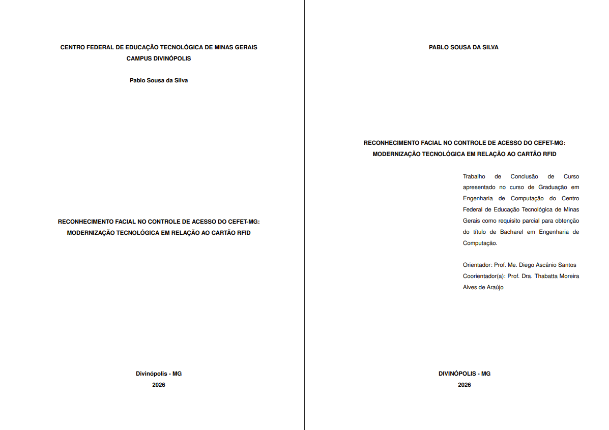

# Reconhecimento Facial no Controle de Acesso do CEFET-MG



Este repositório contém o material de Trabalho de Conclusão de Curso intitulado: "Reconhecimento Facial no Controle de Acesso do CEFET-MG: Modernização Tecnológica em Relação ao Cartão RFID".

O projeto investiga a viabilidade de substituir cartões físicos de acesso, como RFID/NFC, por um sistema de autenticação baseado em reconhecimento facial, utilizando representações vetoriais de características faciais conhecidas como embeddings. A proposta combina validação experimental com o desenvolvimento de um protótipo funcional em tempo real para autenticação em ambientes institucionais.

## Sobre o trabalho

O estudo foi desenvolvido no contexto do CEFET-MG e analisa a possibilidade de modernizar o controle de acesso acadêmico e institucional, reduzindo dependência de dispositivos físicos e melhorando aspectos de segurança, praticidade e experiência do usuário.

Entre os principais objetivos do trabalho, destacam-se:

- avaliar a viabilidade técnica do uso de reconhecimento facial como alternativa aos cartões RFID/NFC;
- validar o uso de embeddings faciais e métricas de similaridade para diferenciação de identidades;
- desenvolver um protótipo funcional capaz de realizar cadastro, gerenciamento e identificação em tempo real;
- considerar aspectos éticos, de privacidade e conformidade com a LGPD;
- analisar a robustez do sistema por meio de métricas como FAR e FRR.

## Tecnologias e abordagem

A solução proposta utiliza técnicas de visão computacional e aprendizado profundo, com foco em modelos pré-treinados para extração de embeddings faciais. O protótipo implementa:

- detecção facial e alinhamento de landmarks;
- geração de embeddings por meio do modelo ArcFace;
- comparação entre vetores faciais por métricas de similaridade;
- armazenamento local de dados biométricos;
- cadastro multi-pose e avaliação de qualidade das capturas;
- votação temporal para aumentar a robustez das decisões de autenticação;
- interface gráfica para cadastro e identificação de usuários.

## Estrutura do repositório

- `main.tex` — arquivo principal do documento LaTeX;
- `Dados.tex` — dados do trabalho, autor, orientador, instituição e pré-textuais;
- `1-Pre-Textual/` — abstract, resumo e elementos pré-textuais;
- `2-Textual/` — capítulos do trabalho;
- `3-Pos-Textual/` — anexos, apêndices e glossário;
- `Imagens/` — arquivos gráficos, capturas e capa do projeto;
- `Pacotes/` — estilos e configurações do template LaTeX.

## Requisitos

Para compilar o documento localmente, é necessário ter instalado:

- LaTeX (preferencialmente com `texlive-full` ou equivalente);
- `latexmk` para geração automática do PDF;
- editor de preferência, como VS Code com a extensão LaTeX Workshop.

## Execução local

No terminal, na pasta do projeto, execute:

```bash
latexmk -pdf -output-directory=out main.tex
```

Esse comando gera o PDF final do trabalho em uma pasta de saída separada para manter a raiz do projeto organizada.

## Execução no Overleaf

Também é possível importar o projeto para o Overleaf e compilar diretamente no ambiente online.

## Autor

- Pablo Sousa da Silva

## Orientação

- Orientador: Prof. Me. Diego Ascânio Santos
- Coorientador(a): Prof. Dra. Thabatta Moreira Alves de Araújo

## Observações

Este repositório reúne tanto a parte documental do TCC quanto os elementos necessários para a compilação da monografia acadêmica, incluindo a estrutura do texto, os capítulos e os materiais visuais do projeto.

---

Se quiser, posso também criar uma versão mais enxuta do README para GitHub, ou uma versão mais formal, com resumo acadêmico em inglês e em português.
